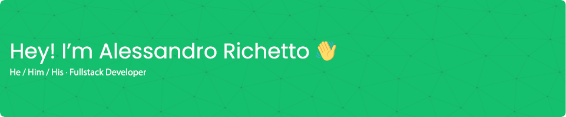

## About Me 🙌

I'm a 25 years old Full Stack Developer with a passion for technology 👨‍💻, travel ✈️, video games 🎮 and keyboards ⌨️. With almost 5 years of experience, I enjoy creating innovative solutions and staying up-to-date with the latest trends. Outside of work, I'm an adventurous soul who seeks new experiences and embraces different cultures. Let's connect and explore the possibilities together!   

## Languages 🗣️
<picture class="icon">
  <source media="(prefers-color-scheme: dark)" srcset="icons/angular.svg">
  <source media="(prefers-color-scheme: light)" srcset="icons/angular.svg">
  
</picture>
&nbsp;
<picture class="icon">
  <source media="(prefers-color-scheme: dark)" srcset="icons/angularJs.svg">
  <source media="(prefers-color-scheme: light)" srcset="icons/angularJs.svg">
  
</picture>
&nbsp;
<picture class="icon">
  <source media="(prefers-color-scheme: dark)" srcset="icons/nodedotjs.svg">
  <source media="(prefers-color-scheme: light)" srcset="icons/nodedotjs.svg">
  
</picture>
&nbsp;
<picture class="icon">
  <source media="(prefers-color-scheme: dark)" srcset="icons/sass.svg">
  <source media="(prefers-color-scheme: light)" srcset="icons/sass.svg">
  
</picture>
&nbsp;
<picture class="icon">
  <source media="(prefers-color-scheme: dark)" srcset="icons/javascript.svg">
  <source media="(prefers-color-scheme: light)" srcset="icons/javascript.svg">
  
</picture>
&nbsp;
<picture class="icon">
  <source media="(prefers-color-scheme: dark)" srcset="icons/php.svg">
  <source media="(prefers-color-scheme: light)" srcset="icons/php.svg">
  
</picture>
&nbsp;
<picture class="icon">
  <source media="(prefers-color-scheme: dark)" srcset="icons/laravel.svg">
  <source media="(prefers-color-scheme: light)" srcset="icons/laravel.svg">
  
</picture>
&nbsp;
<picture class="icon">
  <source media="(prefers-color-scheme: dark)" srcset="icons/express.svg">
  <source media="(prefers-color-scheme: light)" srcset="icons/express.svg">
  
</picture>
&nbsp;
<picture class="icon">
  <source media="(prefers-color-scheme: dark)" srcset="icons/dotnet.svg">
  <source media="(prefers-color-scheme: light)" srcset="icons/dotnet.svg">
  
</picture>
&nbsp;
<picture class="icon">
  <source media="(prefers-color-scheme: dark)" srcset="icons/csharp.svg">
  <source media="(prefers-color-scheme: light)" srcset="icons/csharp.svg">
  
</picture>
&nbsp;
<picture class="icon">
  <source media="(prefers-color-scheme: dark)" srcset="icons/arduino.svg">
  <source media="(prefers-color-scheme: light)" srcset="icons/arduino.svg">
  
</picture>
&nbsp;
<picture class="icon">
  <source media="(prefers-color-scheme: dark)" srcset="icons/html5.svg">
  <source media="(prefers-color-scheme: light)" srcset="icons/html5.svg">
  
</picture>
&nbsp;
<picture class="icon">
  <source media="(prefers-color-scheme: dark)" srcset="icons/css3.svg">
  <source media="(prefers-color-scheme: light)" srcset="icons/css3.svg">
  
</picture>
&nbsp;
<picture class="icon">
  <source media="(prefers-color-scheme: dark)" srcset="icons/tailwindcss.svg">
  <source media="(prefers-color-scheme: light)" srcset="icons/tailwindcss.svg">
  
</picture>
&nbsp;

 

## Databases 📋
<picture class="icon">
  <source media="(prefers-color-scheme: dark)" srcset="icons/mysql.svg">
  <source media="(prefers-color-scheme: light)" srcset="icons/mysql.svg">
  
</picture>
&nbsp;
<picture class="icon">
  <source media="(prefers-color-scheme: dark)" srcset="icons/mariadb.svg">
  <source media="(prefers-color-scheme: light)" srcset="icons/mariadb.svg">
  
</picture>
&nbsp;
<picture class="icon">
  <source media="(prefers-color-scheme: dark)" srcset="icons/mongodb.svg">
  <source media="(prefers-color-scheme: light)" srcset="icons/mongodb.svg">
  
</picture>
&nbsp;
<picture class="icon">
  <source media="(prefers-color-scheme: dark)" srcset="icons/microsoftsqlserver.svg">
  <source media="(prefers-color-scheme: light)" srcset="icons/microsoftsqlserver.svg">
  
</picture>
&nbsp;

 

## Tools 🛠️
<picture class="icon">
  <source media="(prefers-color-scheme: dark)" srcset="icons/windowsterminal.svg">
  <source media="(prefers-color-scheme: light)" srcset="icons/windowsterminal.svg">
  
</picture>
&nbsp;
<picture class="icon">
  <source media="(prefers-color-scheme: dark)" srcset="icons/gnubash.svg">
  <source media="(prefers-color-scheme: light)" srcset="icons/gnubash.svg">
  
</picture>
&nbsp;
<picture class="icon">
  <source media="(prefers-color-scheme: dark)" srcset="icons/gulp.svg">
  <source media="(prefers-color-scheme: light)" srcset="icons/gulp.svg">
  
</picture>
&nbsp;
<picture class="icon">
  <source media="(prefers-color-scheme: dark)" srcset="icons/icomoon.svg">
  <source media="(prefers-color-scheme: light)" srcset="icons/icomoon.svg">
  
</picture>
&nbsp;
<picture class="icon">
  <source media="(prefers-color-scheme: dark)" srcset="icons/openai.svg">
  <source media="(prefers-color-scheme: light)" srcset="icons/openai.svg">
  
</picture>
&nbsp;
<picture class="icon">
  <source media="(prefers-color-scheme: dark)" srcset="icons/powershell.svg">
  <source media="(prefers-color-scheme: light)" srcset="icons/powershell.svg">
  
</picture>
&nbsp;
<picture class="icon">
  <source media="(prefers-color-scheme: dark)" srcset="icons/eslint.svg">
  <source media="(prefers-color-scheme: light)" srcset="icons/eslint.svg">
  
</picture>
&nbsp;
<picture class="icon">
  <source media="(prefers-color-scheme: dark)" srcset="icons/prettier.svg">
  <source media="(prefers-color-scheme: light)" srcset="icons/prettier.svg">
  
</picture>
&nbsp;
<picture class="icon">
  <source media="(prefers-color-scheme: dark)" srcset="icons/stylelint.svg">
  <source media="(prefers-color-scheme: light)" srcset="icons/stylelint.svg">
  
</picture>
&nbsp;

 

## IDEs ⌨️
<picture class="icon">
  <source media="(prefers-color-scheme: dark)" srcset="icons/visual_studio_code.svg">
  <source media="(prefers-color-scheme: light)" srcset="icons/visual_studio_code.svg">
  
</picture>
&nbsp;
<picture class="icon">
  <source media="(prefers-color-scheme: dark)" srcset="icons/sublimetext.svg">
  <source media="(prefers-color-scheme: light)" srcset="icons/sublimetext.svg">
  
</picture>
&nbsp;
<picture class="icon">
  <source media="(prefers-color-scheme: dark)" srcset="icons/jetbrains.svg">
  <source media="(prefers-color-scheme: light)" srcset="icons/jetbrains.svg">
  
</picture>
&nbsp;
<picture class="icon">
  <source media="(prefers-color-scheme: dark)" srcset="icons/neovim.svg">
  <source media="(prefers-color-scheme: light)" srcset="icons/neovim.svg">
  
</picture>
&nbsp;
<picture class="icon">
  <source media="(prefers-color-scheme: dark)" srcset="icons/notepadplusplus.svg">
  <source media="(prefers-color-scheme: light)" srcset="icons/notepadplusplus.svg">
  
</picture>
&nbsp;
<picture class="icon">
  <source media="(prefers-color-scheme: dark)" srcset="icons/visual_studio.svg">
  <source media="(prefers-color-scheme: light)" srcset="icons/visual_studio.svg">
  
</picture>
&nbsp;

 

## Time and Project Management ⏰
<picture class="icon">
  <source media="(prefers-color-scheme: dark)" srcset="icons/redmine.svg">
  <source media="(prefers-color-scheme: light)" srcset="icons/redmine.svg">
  
</picture>
&nbsp;
<picture class="icon">
  <source media="(prefers-color-scheme: dark)" srcset="icons/jira.svg">
  <source media="(prefers-color-scheme: light)" srcset="icons/jira.svg">
  
</picture>
&nbsp;

 

## Package managers 📦
<picture class="icon">
  <source media="(prefers-color-scheme: dark)" srcset="icons/yarn.svg">
  <source media="(prefers-color-scheme: light)" srcset="icons/yarn.svg">
  
</picture>
&nbsp;
<picture class="icon">
  <source media="(prefers-color-scheme: dark)" srcset="icons/npm.svg">
  <source media="(prefers-color-scheme: light)" srcset="icons/npm.svg">
  
</picture>
&nbsp;
<picture class="icon">
  <source media="(prefers-color-scheme: dark)" srcset="icons/composer.svg">
  <source media="(prefers-color-scheme: light)" srcset="icons/composer.svg">
  
</picture>

 

## OS 💻
<picture class="icon">
  <source media="(prefers-color-scheme: dark)" srcset="icons/windows.svg">
  <source media="(prefers-color-scheme: light)" srcset="icons/windows.svg">
  
</picture>
&nbsp;
<picture class="icon">
  <source media="(prefers-color-scheme: dark)" srcset="icons/linux.svg">
  <source media="(prefers-color-scheme: light)" srcset="icons/linux.svg">
  
</picture>
&nbsp;
<picture class="icon">
  <source media="(prefers-color-scheme: dark)" srcset="icons/ubuntu.svg">
  <source media="(prefers-color-scheme: light)" srcset="icons/ubuntu.svg">
  
</picture>
&nbsp;
<picture class="icon">
  <source media="(prefers-color-scheme: dark)" srcset="icons/debian.svg">
  <source media="(prefers-color-scheme: light)" srcset="icons/debian.svg">
  
</picture>
&nbsp;
<picture class="icon">
  <source media="(prefers-color-scheme: dark)" srcset="icons/archlinux.svg">
  <source media="(prefers-color-scheme: light)" srcset="icons/archlinux.svg">
  
</picture>
&nbsp;

 

## Programs 💿
<picture class="icon">
  <source media="(prefers-color-scheme: dark)" srcset="icons/google_chrome.svg">
  <source media="(prefers-color-scheme: light)" srcset="icons/google_chrome.svg">
  
</picture>
&nbsp;
<picture class="icon">
  <source media="(prefers-color-scheme: dark)" srcset="icons/mozilla_firefox.svg">
  <source media="(prefers-color-scheme: light)" srcset="icons/mozilla_firefox.svg">
  
</picture>
&nbsp;
<picture class="icon">
  <source media="(prefers-color-scheme: dark)" srcset="icons/microsoftedge.svg">
  <source media="(prefers-color-scheme: light)" srcset="icons/microsoftedge.svg">
  
</picture>
&nbsp;
<picture class="icon">
  <source media="(prefers-color-scheme: dark)" srcset="icons/skype.svg">
  <source media="(prefers-color-scheme: light)" srcset="icons/skype.svg">
  
</picture>
&nbsp;
<picture class="icon">
  <source media="(prefers-color-scheme: dark)" srcset="icons/microsoftoffice.svg">
  <source media="(prefers-color-scheme: light)" srcset="icons/microsoftoffice.svg">
  
</picture>
&nbsp;
<picture class="icon">
  <source media="(prefers-color-scheme: dark)" srcset="icons/microsoftsharepoint.svg">
  <source media="(prefers-color-scheme: light)" srcset="icons/microsoftsharepoint.svg">
  
</picture>
&nbsp;
<picture class="icon">
  <source media="(prefers-color-scheme: dark)" srcset="icons/microsoftteams.svg">
  <source media="(prefers-color-scheme: light)" srcset="icons/microsoftteams.svg">
  
</picture>
&nbsp;
<picture class="icon">
  <source media="(prefers-color-scheme: dark)" srcset="icons/adobe_premiere_pro.svg">
  <source media="(prefers-color-scheme: light)" srcset="icons/adobe_premiere_pro.svg">
  
</picture>
&nbsp;
<picture class="icon">
  <source media="(prefers-color-scheme: dark)" srcset="icons/virtualbox.svg">
  <source media="(prefers-color-scheme: light)" srcset="icons/virtualbox.svg">
  
</picture>
&nbsp;

 

## Currently learning 🌱
<picture class="icon">
  <source media="(prefers-color-scheme: dark)" srcset="icons/spring_boot.svg">
  <source media="(prefers-color-scheme: light)" srcset="icons/spring_boot.svg">
  
</picture>
&nbsp;
<picture class="icon">
  <source media="(prefers-color-scheme: dark)" srcset="icons/vuedotjs.svg">
  <source media="(prefers-color-scheme: light)" srcset="icons/vuedotjs.svg">
  
</picture>
&nbsp;
<picture class="icon">
  <source media="(prefers-color-scheme: dark)" srcset="icons/react.svg">
  <source media="(prefers-color-scheme: light)" srcset="icons/react.svg">
  
</picture>
&nbsp;
<picture class="icon">
  <source media="(prefers-color-scheme: dark)" srcset="icons/nextdotjs.svg">
  <source media="(prefers-color-scheme: light)" srcset="icons/nextdotjs.svg">
  
</picture>
&nbsp;

 

## Projects 🚀
Check out some of the awesome projects I've worked on:
 
### [The Avanzers 🦸‍♀️🦸‍♂️](https://avanzers.delphinet.it/)
A website designed to connect donors, volunteers, and individuals in need, with a focus on combating food insecurity. This platform empowers donors to contribute various food types and enables volunteers to distribute these donations to those who require assistance.

## Contact Me 📞
I'm always up for new opportunities and collaborations. Feel free to connect. Let's grab a virtual ☕️ and chat about exciting projects or brainstorm some wild ideas.
 
If you have any questions or just want to say hi, don't be shy! Get in touch with me.

<a href="mailto:alessandrokevin98@gmail.com" style="text-decoration: none">
  <picture class="icon">
    <source media="(prefers-color-scheme: dark)" srcset="icons/gmail.svg">
    <source media="(prefers-color-scheme: light)" srcset="icons/gmail.svg">
    
  </picture>
</a>
&nbsp;
<a href="https://www.linkedin.com/in/arichetto/" style="text-decoration: none">
<picture class="icon">
  <source media="(prefers-color-scheme: dark)" srcset="icons/linkedin.svg">
  <source media="(prefers-color-scheme: light)" srcset="icons/linkedin.svg">
  
</picture>
</a> 
   
Thank you for visiting my GitHub profile! 🙏
